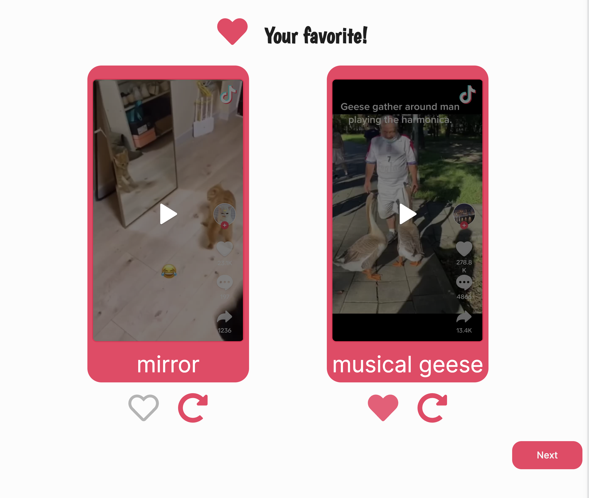

# TikTok Pets
- TikTok Pets is a full-stack web application inspired by TikTok, but with a focus solely on our beloved pets. Developed as a personal project to enhance my skills in web development, TikTok Pets allows users to share short video clips, images, and stories of their furry, feathery, or scaly companions. Through a combination of React for the frontend, HTML/CSS/JS for styling and interactivity, Node.js and Express for the backend, and SQLite3 for database management, TikTok Pets provides a seamless and engaging experience for pet lovers worldwide.

# Libraries needed to install:
Express, body-parser,pagerank-js, sqlite3:
- npm install express, body-parser, pagerank-js, sqlite3 

Created back in May 2022